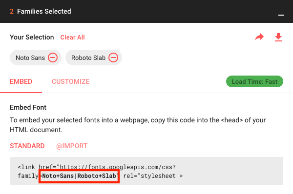

0. this unordered seed list will be replaced by toc as unordered list
{:toc}


## 소프트웨어 공학 개념

* 시스템 기본요소 : 입력, 처리, 출력, 제어, 피드백
* 소프트웨어 위기 : SW가 HW를 따라가지 못함(개발이용, 개발지연, 인력부족 및 인건비 상승, 성능부족, 유지보수비용 증가)


## 재공학 : `시스템변경이나, 재구조화 통해 생산성 증가`

* 재공학의 장점 : 개발시간 및 비용감소, 품질 및 생산성 향상, 신뢰성향상, 지식의 공유, 개발 실패위험 감소

- 분석 - 구성 - 역공학 `(코드분석으로 설계정보 발견하고, 재제작)` - 이식 `(새환경에서도 사용할 수 있도록 변환)`의 순으로 진행

* CASE : 요구분석, 설계, 구현, 검사 및 디버깅을 자동화해서 생산성 향상 - `시험에 잘나옴`

*SADT : CASE의 도구로 분석 및 설계 관련 자동화 도구, 블록다이어그램을 채택


[재공학, 역공학](https://blog.naver.com/dilector/222841916131)

~~~yml
# file: `재공학,역공학.yml`
url: https://blog.naver.com/dilector/222841916131
~~~


## 소프트웨어 개발 방법론

### 설계방법론

* 폭포수모형(선형순차모형) : 긱 단계가 순차적으로

* 나선형 모형 : Boehm이 제시, 반복작업 수행, 점증적 모형, 유지보수 불필요!
- 계획 수림 - 위험분석 - 개발검증 - 고객평가를 무한루핑

* 하향식 설게 (상위기능부터 설계) vs 상향식 설계 (기본 컴포넌트 먼저 설계)

* 프로토타입 모형 : 견본을 미리 만들어 고객과 소통

* HIPO : 입력, 처리, 출력으로 구성하는 하향식 방법, 가시적 도표, 다이어그램, 구조도 사용 (POWER BI)

* V모델 : V자형으로 시스템 검증과 각 단계별로 테스트작업 대응

### 애자일 개발 방법론 (다수출제)

* 고객 피드백 중요시해서, 설게변경에 신속대응

* XP, SCRUM, Lean, FDD(기능중심개발), DSDM등이 있음

* 애자일 선언 : 문서가 아니라 실행 sw를 중시하면서 프로세스나 도구보다 개인과의 소통이 중요하다

### XP (eXtreme Programming) : 12가지 실천사항 있음

* 고객 참여와 개발과정을 반복해, 생산성을 향상시킴( 소통, 단순성, 피드백, 용기, 존중이 중요한 핵심가치)


## SCRUM

### SCRUM 개념: 요구사항 신속대처하도록 점진적인 소규모 팀원간 활발한 의사소통과 협동심이 필요한 팀중심 sw개발방법론

* 스프린트 (30일 반복) 단위로 sw개발

* 제품책임자 (스프린트 후에는 간여 안함) - 스크럼마스터 (조직, 관리) - 스프럼팀 (5-9명)구성

### SCRUM과정

* 스프린팅 (전력질주) : 2~4주 반복주기마다 이해관계자에게 진척도 보고

* Daily SCRUM 미팅 : 15분 정도 서서 상황체크


## 현행시스템 분석 : 시스템 개발 범위 확인하고, 이행방향성 설정

### 절차

* 1단계 : 시스템 구성파악 - 기능파악 - 인터페이스 현황 파악(데이터, 통신규약 등)

* 2단계 : 아ㅣ텍처 파악 - SW구성 파악

* 3단계 : 시스템 하드웨어 현황 파악 - 네트워크 구성 파악

### FEP (Front - End Processor) : 앞서서 미리 처리해서 프로세서 처리시간 줄임

### 플랫폼 파악 : 응답시간, 가용성, 사용률 확인

### DBMS 분석 : 가용성, 성능, 기술지원, 상호호환성, 구축비용 (not. 네트워크 구성도)

## 요구사항 개발

* 요구공학 : 사용자요구 반영한 시스템 개발을 위해 추출, 분석, 검증, 관리하는 구조화된 활동

### SWEBOL (SW공학 지식체계) : 요구사항 도출 - 분석 - 명세 - 검증

- 고객발표, 문서조사, 설문, 양식조사, 브레인스토밍, 워크숍, 인터뷰, 벤치마킹 등

### 요구사항 분석 : 요구사항 정의를 문서화하는 과정

- 사용자 의견 청취, 사용자 인터뷰, 문서분석과 관찰, 모델장석 기술, 설문조사 등

- 요구사항은 기능적 요구사항, 비기능적 요구사항으로 구분하며 우선순위 작성

### 요구사항 관리도구 필요성 : 요구사항 변경으로 인한 비용편익분석, 요구사항 변경의 추적, 요구사항 변경에 다른 영향평가 위해

## UML

* UML : 시스템 분석, 설계 구현 등 산출물을 명세화, 시각화할 때 사용하는 모델링 언어

-- 기능적 관점 : 사용사레 모델링 (Use Case다이어그램 - 객체관계 추상화)
-- 정적 관점 : SW내부의 구조관계 나타냄 (class 다이어그램)
-- 동적 관점 : 시스템 내부동작(순차 다이어그램 등)

* 럼바우 객체지향 분석 기법 (객체 모델링 기법)
-- 시스템이 요구하는 객체를 찾아서 속성과 연산식별 및 객체들간 관계를 규정해 다이어그램으로 표시
-- 객체모델링 (객체를 다이어그램으로) vs


When hosting on [GitHub Pages](https://pages.github.com/) the `url` is `https://<username>.github.io`
(unless you are using a custom domain).

The `baseurl` depends on the kind of page you are hosting.

* When hosting a *user or organization page*, use the empty string `''`.
* When hosting *project page*, use `/<reponame>`.

For for information on the types of pages you can host on GitHub, see the
[GitHub Help article](https://help.github.com/articles/user-organization-and-project-pages/).


## Changing accent colors and sidebar images
Hydejack allows you to choose the background image of the sidebar, as well as the accent color
(color of the links, selection and focus outline, etc...).

~~~yml
# file: `_config.yml`
accent_image: /assets/img/sidebar-bg.jpg
accent_color: rgb(79,177,186)
~~~

I recommend using a blurred image in order for the text to remain readable.
If you save a blurred image as JPG, it will also drastically reduce its file size.
{:.note}

The `accent_image` property also accepts the special value `none` which will remove the default image.

If your sidebar image contains bright colors, the white text can be difficult to read. In this case, consider setting
`invert_sidebar: true` in the front matter to invert the text colors in the sidebar. 
Use [front matter defaults][fmd] to enable this on all pages (see below).

Note that these values can be overwritten on a per-page basis, i.e. you can create a unique look for each page.
You can also apply a certain look to all posts in a category via [front matter defaults][fmd], e.g.:

```yml
# file: `_config.yml`
defaults:
  - scope:
      path:         hydejack/
    values:
      accent_image: /assets/img/hydejack-bg.jpg
      accent_color: rgb(38,139,210)
```

### Theme color
Hydejack also supports the `theme_color` property. When set, it will change the background color of the sidebar, as well as set the `theme_color` property in the [Web App Manifest][wam]. In some browsers, such as Chrome on Android, this will change the color of the browser's UI components.

~~~yml
# file: `_config.yml`
theme_color:  rgb(25,55,71)
~~~

Just like `accent_*` properties, the theme color can be overridden on a per-page basis by setting it in the front matter.

[wam]: https://web.dev/add-manifest/#theme-color

## Changing fonts
Hydejack lets you configure the font of regular text and headlines, and it has built-in support for Google Fonts.
There are three keys in `_config.yml` associated with this: `font`, `font_heading` and `google_fonts`.
The defaults are:

~~~yml
# file: `_config.yml`
font:         Noto Sans, Helvetica, Arial, sans-serif
font_heading: Roboto Slab, Helvetica, Arial, sans-serif
google_fonts: Roboto+Slab:700|Noto+Sans:400,400i,700,700i
~~~

`font` and `font_heading` must be valid CSS `font-family` values. When using Google Fonts make sure to provide at least one fallback.

The `google_fonts` key is the string necessary to fetch the fonts from Google.
You can get it from the download page at [Google Fonts](https://fonts.google.com) after you've selected one or more fonts:

{:width="600" height="398" loading="lazy"}


### Removing Google Fonts
If you prefer not to use Google Fonts and remove all associated code from the site,
set the `google_fonts` key to `false`.

The `no_google_fonts` parameter has been removed in v9 and no longer has any effect.
{:.note }


## Choosing a blog layout
Hydejack features three layouts for showing your blog posts.

* The [`list` layout][posts] only shows the title and groups the posts by year of publication.
* The [`grid` layout][grid]\* is exclusive to the PRO Version and will show a content card (with `image`) for each post.
* The [`blog` layout][blog] is a traditional paginated layout and shows the title and an excerpt of each post.

[blog]: https://hydejack.com/blog/
[posts]: https://hydejack.com/posts/
[grid]: https://hydejack.com/blog/hydejack/

In order to use the `list` or `grid` layout add the following front-matter to a new markdown file:

~~~yml
---
layout: list # or `grid`
title:  Home
---
~~~

If you want to use the `blog` layout, you need to add `jekyll-paginate` to your `Gemfile` and to the `plugins` list in your config file:

```ruby
# file: `Gemfile`
gem "jekyll-paginate"
```

```yml
# file: `_config.yml`
plugins:
  - jekyll-paginate
```

You also need to add the `paginate` and `paginate_path` keys to your config file, e.g.

~~~yml
# file: `_config.yml`
paginate:      10
paginate_path: '/:num/'
~~~

The `blog` layout needs to be applied to a file with the `.html` file extension
and the `paginate_path` needs to match the path to the `index.html` file.
To match the `paginate_path` above, put a `index.html` with the following front matter in the root directory:

~~~yml
# file: `index.html`
---
layout: blog
title: Blog
---
~~~

For more information see [Pagination](https://jekyllrb.com/docs/pagination/).


### Using the `blog` layout in a subdirectory
If you want to use the blog layout at a URL like `/my-blog/`, create the following folder structure:

~~~
├── my-blog
│   └── index.html
└── _config.yml
~~~

You can use the same `index.html` as before and place it in the subdirectory.

~~~yml
# file: `my-blog/index.html`
---
layout: blog
title: Blog
---
~~~

In your config file, make sure the `paginate_path` matches the name of the subdirectory:

~~~yml
# file: `_config.yml`
paginate:      10
paginate_path: /my-blog/:num/ #!!
~~~

To add an entry in the sidebar to your blog directory, see [Adding an entry to the sidebar](./basics.md#adding-an-entry-to-the-sidebar).


## Adding an author
At a bare minimum, you should add an `author` key with a `name` and `email` sub-key
(used by the [feed plugin](https://github.com/jekyll/jekyll-feed)) to to your config file:

~~~yml
# file: `_config.yml`
author:
  name:  Florian Klampfer
  email: mail@qwtel.com
~~~

If you would like the author to be displayed in the about section below a post or project\*, add an `about` key and provide markdown content. I recommend using the YAML pipe `|` syntax, so you can include multiple paragraphs:

~~~yml
# file: `_config.yml`
author:
  name:  Florian Klampfer
  email: mail@qwtel.com
  about: |
    Hi, I'm Florian or @qwtel...

    This is another paragraph.
~~~


### Adding an author's picture
If you'd like for the author's picture to appear in addition the about text (see above), you can either use the [`jekyll-avatar`](https://github.com/benbalter/jekyll-avatar) plugin or provide URLs to images manually.

To use the plugin, add it to your `Gemfile` and the list of `plugins` in your config file:

```ruby
# file: `Gemfile`
gem "jekyll-avatar"
```

```yml
# file: `_config.yml`
plugins:
  - jekyll-avatar
```

Run `bundle install` for the changes to take effect.

Make sure you have provided a GitHub username in your config file (`github_username`),
or to the author key (`author.social.github`, `author.github.username`, or `author.github`).
See [Adding social media icons](#adding-social-media-icons) for more.

To set an image manually, you have to provide an URL to the author's `picture` key:

~~~yml
# file: `_config.yml`
author:
  picture:  /assets/img/me.jpg
~~~

If you'd like to provide multiple versions for screens with different pixel densities,
you can provide `path` and `srcset` keys instead:

~~~yml
# file: `_config.yml`
author:
  picture:
    path:   /assets/img/me.jpg
    srcset:
      1x:   /assets/img/me.jpg
      2x:   /assets/img/me@2x.jpg
~~~

The keys of the `srcset` hash will be used as image descriptors. For more information on `srcset`, see the [documentation at MDN][mdnsrcset], or [this article from CSS-Tricks][csssrcset].

[mdnsrcset]: https://developer.mozilla.org/en-US/docs/Web/HTML/Element/img#attr-srcset
[csssrcset]: https://css-tricks.com/responsive-images-youre-just-changing-resolutions-use-srcset/


### Adding social media icons
Hydejack supports a variety of social media icons out of the box. These are defined on a per-author basis, so make sure you've followed the steps in [Adding an author](#adding-an-author).

If you are using the gem-based version of Hydejack, download [`social.yml`][social] and put it into `_data` in the root directory. This is necessary because gem-based themes do not support including `_data`.
{:.note}

You can add a link to a social network by adding an entry to the `social` key in to an author.
It consists of the name of the social network as key and your username within that network as value, e.g.

~~~yml
# file: `_config.yml`
author:
  social:
    twitter: qwtel
    github:  qwtel
~~~

Check out [`authors.yml`][authors] to see which networks are available.
You can also follow the steps [here](advanced.md) to add your own social media icons.

You can change the order in which the icons appear by moving lines up or down, e.g.

~~~yml
# file: `_config.yml`
author:
  social:
    github:  qwtel # now github appears first
    twitter: qwtel
~~~

To get an overview of which networks are available and how a typical username in that network looks like,
see the included [`authors.yml`][authors].

Should providing a username not produce a correct link for some reason, you can provide a complete URL instead, e.g.

~~~yml
# file: `_config.yml`
author:
  social:
    youtube: https://www.youtube.com/channel/UCu0PYX_kVANdmgIZ4bw6_kA
~~~

You can add any platform, even if it's not defined in [`social.yml`][social], by providing a complete URL. However, a fallback icon <span class="icon-link"></span> will be used when no icon is available. Supplying your own icons is an [advanced topic](advanced.md).
{:.note}


### Adding an email, RSS icon or download icon
If you'd like to add an email <span class="icon-mail"></span>, RSS <span class="icon-rss2"></span>, or download <span class="icon-box-add"></span> icon to the list, add the `email`, `rss`, or `download` key, e.g.:

~~~yml
# file: `_config.yml`
author:
  social:
    email:    mail@qwtel.com
    rss:      {{ site.url }}{{ site.baseurl }}/feed.xml # make sure you provide an absolute URL
    download: https://github.com/hydecorp/hydejack/archive/v9.1.6.zip
~~~


## Enabling comments
Hydejack supports comments via [Disqus](https://disqus.com/). Before you can add comments to a page you need to register and add your site to Disqus' admin console. Once you have obtained your "Disqus shortname", you include it in your config file:

~~~yml
# file: `_config.yml`
disqus: <disqus shortname>
~~~

Now comments can be enabled by adding `comments: true` to the front matter.

~~~yml
---
layout:   post
title:    Hello World
comments: true
---
~~~

You can enable comments for entire classes of pages by using [front matter defaults][fmd].
E.g. to enable comments on all posts, add to your config file:

~~~yml
# file: `_config.yml`
defaults:
  - scope:
      type: posts
    values:
      comments: true
~~~

[fmd]: https://jekyllrb.com/docs/configuration/#front-matter-defaults


## Enabling Google Analytics
Enabling Google Analytics is as simple as setting the `google_analytics` key.

~~~yml
# file: `_config.yml`
google_analytics: UA-XXXXXXXX-X
~~~

To remove Google Analytics and all associated code from the site, set the `google_analytics` key to `false`.


### Using a custom analytics provider
If you want to use a different analytics provider such as [Matomo](https://matomo.org/), you can add its code snippet to `_includes/my-body.html` (create if it doesn't exist).
The [default file][mybody] contains an example.

## Changing built-in strings
You can change the wording of built-in strings like "Related Posts" or "Read more" in `_data/strings.yml`.

If you are using the gem-based version the file doesn't exist, but you can get the default file [here][strings].

You will frequently find markers like `<!--post_title-->`.
You can place them freely within your string and they will be replaced with the content they refer to.

You may also use this feature to translate the theme into different languages.
In this case you should also set the `lang` key to your config file, e.g.

```yml
# file: `_config.yml`
lang: cc-ll
```

where `cc` is the 2-letter country code and `ll` specifies a 2-letter location code, e.g.: `de-at`.

You may also change the strings used for formatting dates and times (look out for the `date_formats` key), but be aware that the values you provide need to be valid Ruby [format directives](http://ruby-doc.org/core-2.4.1/Time.html#method-i-strftime).


## Adding legal documents
If you have pages for contact data, privacy policy, cookie policy, etc. you can add links to them in the footer by listing them under the `legal` key in your config file as follows:

```yml
# file: `_config.yml`
legal:
  - title: Impress
    url:  /impress/
  - title: Cookies Policy
    url:  /cookies-policy/
```

When using Hydejack's offline feature, the pages listed here will be downloaded and cached when loading the page for the first time.

## Enabling math blocks

Hydejack supports [math blocks][ksynmath] with either [KaTeX] or [MathJax]. 

The _MathJax implementation_ comes with a client-side runtime and works on GitHub Pages. 
It is the more heavy-weight of the two and doesn't work without JavaScript enabled. 
Due to the size of the complete MathJax package, it only works partially with offline support enabled.

The _KaTeX implementation_ pre-renders the KaTeX output during site building.
It's more lightweight because it does not ship a client-side runtime and therefore works without JavaScript.
In my opinion, it is the more elegant solution, but it requires a JavaScript runtime on the machine that builds the site,
i.e. it does not work on GitHub Pages.

You can switch between the two implementations by changing the `kramdown.math_engine` key to either `katex` or `mathjax` in your config file.

```yml
# file: `_config.yml`
kramdown:
  math_engine:         katex
  math_engine_opts:    {}
```

The KaTeX implementation also requires the `kramdown-math-katex` gem in your `Gemfile`. 
If you intend to use MathJax instead, this step is not required.

```ruby
# file: `Gemfile`
gem "kramdown-math-katex"
```

There are a couple of things to know about this gem:
*  It is not supported on GitHub Pages. 
   You have to build the site on your machine before uploading to GitHub,
   or use a more permissive cloud building tool such as Netlify. 
*  You need some kind of JavaScript runtime on your machine.
   Usually installing [NodeJS](https://nodejs.org/en/download/) will suffice. 
   Alternatively, adding `gem "duktape"` will also do.
   For more, see <https://github.com/kramdown/math-katex#documentation>

Before you add math content, remember to run `bundle install` and restart Jekyll.

[ksynmath]: https://kramdown.gettalong.org/syntax.html#math-blocks
[katex]: https://khan.github.io/KaTeX/
[mathjax]: https://www.mathjax.org/


## Adding custom Favicons and App Icons
### Changing the Favicon
By default, Hydejack will use the Favicon from `/assets/icons/favicon.ico` and Apple Touch Icon from `/assets/icons/icon-192x192.png`.
You can either override these files, or override the path in the config file via `favicon` and `app_touch_icon` keys:

```yml
# file: "_config.yml"
favicon: /favicon.ico
apple_touch_icon: /assets/img/blog/getout_company.png
```

### Changing the App Icons
By default, Hydejack includes its own favicon, as well as app icons in 8 different resolutions.

| Name               | Resolution |
|:-------------------|-----------:|
| `icon-512x512.png` |  `512x512` |
| `icon-384x384.png` |  `384x384` |
| `icon-192x192.png` |  `192x192` |
| `icon-152x152.png` |  `152x152` |
| `icon-144x144.png` |  `144x144` |
| `icon-128x128.png` |  `128x128` |
| `icon-96x96.png`   |    `96x96` |
| `icon-72x72.png`   |    `72x72` |

To change the default icons you have to replce all of them. To make this manageable, I recommend using the following tools:

First, use the [Maskable.app Editor](https://maskable.app/editor) to confine your logo/picture to the "minimum safe area". More on maskable app icons, see [this article on web.dev](https://web.dev/maskable-icon). 
Make sure the base image is at least 512x512 pixels in size.

Then use the [Web App Manifest Generator](https://app-manifest.firebaseapp.com/) to automatically resize the icons. 
Upload the icon downloaded from Maskable.app and then click "Generate .zip". 
In the zip, ignore the `manifest.json` and look for the `icons` folder. Copy it into the `assets` folder of your site.

To change the favicon, place your own `favicon.ico` (32x32, PNG) into `assets/icons`.


## Adding a cookies banner*

~~~yml
# file: `_config.yml`
hydejack:
  cookies_banner: true
~~~

Enabling this setting will show a notice at the top of the page to new visitors.
You can change the wording of the notice in `_data/strings.yml`
with the `cookies_banner.text` and `cookies_banner.okay` keys:

~~~yml
# file: `_data/strings.yml`
cookies_banner:
  text: This site uses cookies. [Markdown allowed](/cookies-policy/)!
  okay: Okay
~~~


## Enabling newsletter boxes*
To enable showing newsletter subscription boxes below each post and project,
provide your [Tinyletter] username to the `tinyletter` key in the config file.

```yml
# file: `_config.yml`
tinyletter:  <tinyletter username>
```

To edit the content of the newsletter box, open `_data/strings.yml`, and change the entries under the `tinyletter` key.

If want to use a different mailing provider you can build your own form, and insert it into `_includes/my-newsletter.html`. The file includes an example form for MailChimp, where you need to fill in `site.mailchimp.action` and `site.mailchimp.hidden_input` (you can get these from MailChimp).

To build a completely new from, you can use [the same CSS classes as Bootstrap](https://getbootstrap.com/docs/4.0/components/forms/). Note that only form, grid and utility classes are available. Check out [Forms by Example](../forms-by-example.md){:.heading.flip-title} for more examples.

[tinyletter]: https://tinyletter.com/


## Enabling Dark Mode*
Buyers of the PRO version have access to a dark-themed version of Hydejack.

Dark mode can be enabled in `config.yml` under the `hydejack` key and has three settings and two adjustments:

```yml
# file: `_config.yml`
hydejack:
  dark_mode:
    dynamic: true
    sunrise: 6
    sunset:  18
    icon:    true
    always:  false
```

Setting `dynamic`, will enable dark mode based on the client's local time (unlike location-based sunset calculations, this approach does not require a permission form the user). You can adjust `sunrise` and `sunset` to change when to show the light/dark theme.

Setting `icon` will show a switch to alternate between the light and dark mode at the top of the page.

Finally, setting `always` will cause dark mode to become the default theme at all times (combine with `dynamic: false`).

Continue with [소프트웨어 개발](study2.md){:.heading.flip-title}
{:.read-more}


[config]: https://github.com/hydecorp/hydejack-starter-kit/blob/v9/_config.yml
[social]: https://github.com/hydecorp/hydejack-starter-kit/blob/v9/_data/social.yml
[authors]: https://github.com/hydecorp/hydejack-starter-kit/blob/v9/_data/authors.yml
[strings]: https://github.com/hydecorp/hydejack-starter-kit/blob/v9/_data/strings.yml
[mybody]: https://github.com/hydecorp/hydejack-starter-kit/blob/v9/_includes/my-body.html

*[FOIT]: Flash of Invisible Text
*[GA]: Google Analytics
